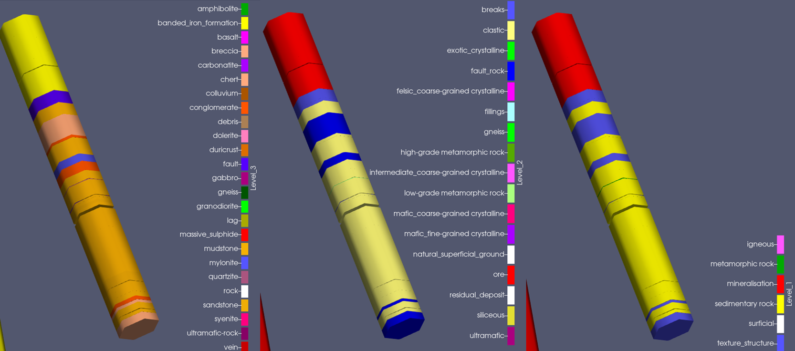

# *dh2loop*   

***dh2loop*** is a python library that provides the functionality to extract and standardize geologic drill hole data and export it into readily importable interval tables (collar, survey, lithology) to feed into 3D modelling packages. It addresses the subjective nature and variability of nomenclature of lithological descriptions within and across different drilling campaigns by integrating published dictionaries, glossaries and/or [thesauri](https://github.com/Loop3D/dh2loop/blob/master/thesauri.md) that were built to improve resolution of poorly defined or highly subjective use of terminology and idiosyncratic logging methods. It also classifies lithological data into multi-level groupings that can be used to systematically upscale and downscale drill hole data inputs in multiscale 3D geological model. It also provides drill hole desurveying (computes the geometry of a drillhole in three-dimensional space) and log correlation functions so that the results can be plotted in 3D and analysed against each other. The workflow behind the string matching is illustrated [here](images/fig07.png). 

*Upscaling Drillhole Data*

**Mark Jessell** contributed the original idea, which was further developed by **Ranee Joshi** (ranee.joshi@research.uwa.edu.au). The code development is lead by **Kavitha Madaiah** (kavitha.madaiah@uwa.edu.au). **Mark Lindsay** and **Guillaume Pirot** have made significant contributions to the direction of the research. 

## Where to start:
  
1. Install the dependencies:
- fuzzywuzzy (https://github.com/seatgeek/fuzzywuzzy)  
`pip install fuzzywuzzy`  
- pandas (https://pandas.pydata.org/)   
`pip install pandas`  
- psycopg2 (https://pypi.org/project/psycopg2/)   
`pip install psycopg2`  
- numpy (https://github.com/numpy/numpy)   
`pip install numpy`  
- nltk (https://github.com/nltk/nltk )   
`pip install nltk`  
- pyproj (https://github.com/pyproj4/pyproj)   
`pip install pyproj`   

2. Clone the repository:  
`$ git clone https://github.com/Loop3D/dh2loop.git`

3. Install from your local drive  
`cd \local_drive\`  
`python setup.py install --user --force`

4. Try out the demo jupyter notebook:
https://github.com/Loop3D/dh2loop/blob/master/notebooks/2_Exporting_and_Text_Parsing_of_Drillhole_Data_Demo.ipynb

## Problems
Any bugs/feature requests/comments please create a new [issue](https://github.com/Loop3D/dh2loop/issues). 

## Acknowledgements
*The research was supported while in receipt of Scholarship for International Research Fees (Australian Government Research Training Program Scholarship) and Automated 3D Geology Modelling PhD Scholarship (University Postgraduate Award) at the University of Western Australia. The work has been supported by the Mineral Exploration Cooperative Research Centre (MinEx CRC; https://minexcrc.com.au/) whose activities are funded by the Australian Government's Cooperative Research Centre Program. This work was also done with the Loop Consortium (http://loop3d.org) as part of an international effort to found a new open-source platform to build the next generation of 3D geological modelling tools.*
